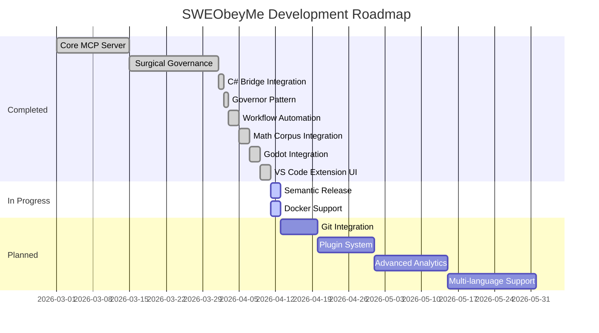

# SWEObeyMe MCP Server

[](https://github.com/stonewolfpc/SWEObeyMe)
[](LICENSE)
[](https://nodejs.org)
[](https://marketplace.visualstudio.com)
[](https://github.com/prettier/prettier)

[](https://twitter.com/SWEObeyMe)
[](https://linkedin.com/company/SWEObeyMe)
[](https://www.paypal.com/donate/?business=9QSRV22WNLFS6&no_recurring=0&currency_code=USD)

> **v2.0.4-beta Project Awareness (April 2026):** Automatic project detection, context switching, and project-specific rule enforcement. The Project Awareness & Context Switching Layer detects project switches, applies project-specific constraints, and maintains project state across sessions. Optimized package size with improved .vscodeignore. Fixed oracle handler registration. Added error handling to prevent webview loading hang. Cleared test artifacts from error log to prevent red MCP status.

> **⚠️ Important Usage Note:** SWEObeyMe is designed for use with **free AI models** and will function correctly on all models. However, due to its comprehensive validation, enforcement, and workflow automation features, it may result in **higher than normal credit consumption** on premium/paid models. The system performs extensive validation, maintains persistent project memory, and enforces strict discipline through multiple tool calls - all of which consume additional tokens. If you're using a paid model, be aware that credit usage may be significantly higher than with basic coding assistants.

A comprehensive Model Context Protocol (MCP) server designed specifically for SWE-1.5 and other AI models to enforce surgical coding standards and prevent technical debt.

## Overview

SWEObeyMe is a surgical governance system that integrates seamlessly with Windsurf, enabling AI models to perform software engineering tasks while maintaining strict architectural standards. It enforces file size limits, prevents forbidden patterns, and ensures code quality through automated validation and enforcement.

### The Governor Pattern

**NEW in v1.0.17:** The Governor Pattern is an enforcement mechanism that intercepts all VS Code workspace operations and routes them through MCP tools. This ensures AI models cannot bypass your architectural rules or make uncontrolled changes to your codebase. The system forces AI to:

- Use surgical tools for all file operations
- Validate changes before applying them
- Follow your architectural blueprint exactly
- Never hallucinate or deviate from defined toolsets
- Maintain predictable, reliable execution

## Features

### 🏛️ Governor Pattern (v1.0.17)
Intercepts all VS Code workspace operations and routes them through MCP tools, forcing AI to use surgical tools, validate changes, follow architectural blueprints, and maintain predictable execution. Zero-trust architecture prevents AI from bypassing governance.

### 🤖 Workflow Automation (v1.3.0)
- **Rule Engine**: 7 strict behavior rules (search-before-edit, explain-before-act, tools-before-manual, no-hallucination, maintain-project-map, follow-conventions, documentation-required)
- **Persistent Project Memory**: Automatic structure indexing, convention detection, decision recording, file purpose tracking
- **Fallback Behavior System**: Intelligent strategies for 7 failure types with context-aware suggestions
- **Anti-Hallucination Protection**: Path verification, file existence checks, tool validation
- **Tool Priority System**: SWEObeyMe tools ranked above Windsurf built-ins
- **Proactive Tool Suggestions**: Context-aware recommendations in all responses
- **5 Project Memory Tools**: index_project_structure, analyze_project_conventions, get_project_memory_summary, record_project_decision, suggest_file_location

**Context**: Addresses AI agent complaints (hallucinations, ignoring toolchains, losing context, poor transparency, poor documentation, no structure enforcement, no self-correction) by enforcing strict discipline.

### 🔧 Core Surgical Governance
Surgical plan validation, smart file operations with automatic backups, code quality enforcement with forbidden pattern detection, atomic backup operations with verification, workflow orchestration, and architectural drift detection.

### 🚀 Advanced Capabilities
Loop detection, auto-repair of JSON/code formatting, session memory tracking, recovery mode for stuck operations, refactoring tools (move blocks, extract modules), and file health analysis for code smells.

### 🎯 C# .NET 8/10 Enhancements (v1.0.13)
Bracket validation, complexity analysis, try-catch detection, async/await validation, resource management (missing using statements), math safety (overflow, division by zero), scope visualization, and comprehensive C# health scoring.

### 📁 File Management (v1.0.13)
File registry system, duplicate detection, operation audit with time-based deduplication, reference validation, same-name detection, similar file detection, project integrity validation, and fast search across thousands of files.

### 📊 Tool Success Metrics & Implementation Philosophy (NEW)
- **Tool Success Metrics**: Comprehensive tracking with `get_tool_metrics` tool (call counts, success rates, error types, performance metrics)
- **Implementation Philosophy Rules**: 3 enforcement rules (IMPLEMENT_DIRECTLY, INFORM_AFTER_IMPLEMENT, NO_FAKE_IMPLEMENTATIONS) preventing stubs, placeholders, and unnecessary user prompts
- **Implementation Decision Tree**: Guides AI on when to implement directly vs ask user

### 📚 Comprehensive Documentation Suite (NEW)
- **COMMON_PATTERNS.md**: 22 successful AI patterns
- **ANTI_PATTERNS.md**: 25 common AI mistakes
- **DECISION_TREE.md**: Visual decision trees for tool selection
- **QUICKSTART.md**: 5-minute setup guide
- **TROUBLESHOOTING.md**: Common issues and solutions
- **BEST_PRACTICES.md**: Configuration guidelines
- **CONFIGURATION_EXAMPLES.md**: Sample configurations
- **FAQ.md**: Comprehensive FAQ
- **PERFORMANCE_TIPS.md**: Optimization recommendations

## Roadmap



### Completed Features (v1.3.0)
- ✅ Core MCP Server with surgical governance
- ✅ C# Bridge integration with error detection
- ✅ Governor Pattern for workspace operation interception
- ✅ Workflow automation with rule engine
- ✅ Math corpus with 13 open-license references
- ✅ Godot project detection and enforcement
- ✅ VS Code extension with status bar, CodeLens, and commands palette
- ✅ Hot-reload capability and improved error messages
- ✅ Semantic-release configuration
- ✅ Docker support

### Planned Features
- 🔲 Git integration foundation (branch management, commit hooks)
- 🔲 Plugin system for custom tool extensions
- 🔲 Advanced analytics and metrics dashboard
- 🔲 Multi-language support (Python, Java, Go, Rust)

## Installation

### Prerequisites

- Node.js 18.0.0 or higher

- Windsurf Next (Phoenix Alpha Fast) or later with ESM support
- Git (for some features)

### Setup

1. Clone or download this repository
2. Install dependencies:
   ```bash
   npm install
   ```
3. Build the project:
   ```bash
   npm run build
   ```
4. Install the VS Code extension (included in this repository)
5. Configure Windsurf to use the MCP server (see Configuration section)

## Configuration

### Windsurf Integration

The VS Code extension automatically configures the MCP server on activation. Manual configuration:

```json
{
  "mcpServers": {
    "swe-obey-me": {
      "command": "node",
      "args": ["--no-warnings", "file:///d:/SWEObeyMe-restored/index.js"],
      "env": {
        "NODE_ENV": "production",
        "SWEOBEYME_BACKUP_DIR": "C:/Users/YourName/AppData/Local/SWEObeyMe/.sweobeyme-backups",
        "SWEOBEYME_DEBUG": "0"
      },
      "disabled": false
    }
  }
}
```

### Environment Variables

- `NODE_ENV`: Set to 'production' for production use
- `SWEOBEYME_BACKUP_DIR`: Custom backup directory (default: `%LOCALAPPDATA%\SWEObeyMe\.sweobeyme-backups`)
- `SWEOBEYME_DEBUG`: Set to '1' for debug logging

### Project Configuration Files

- `.sweobeyme-contract.md`: Project-specific architectural rules
- `.sweignore`: Files to exclude from AI context

## Usage

### Available Tools

The server provides **68 surgical governance tools** organized into categories:

- **Core Surgical Tools (19)**: obey_me_status, obey_surgical_plan, enforce_surgical_rules, auto_repair_submission, get_session_context, get_workflow_status, get_architectural_directive, query_the_oracle, read_file, write_file, list_directory, dry_run_write_file, validate_change_before_apply, diff_changes, get_file_context, verify_syntax, analyze_change_impact, get_symbol_references, enforce_strict_mode

- **Configuration Tools (4)**: get_config, set_config, reset_config, get_config_schema

- **Validation Tools (4)**: check_for_anti_patterns, validate_naming_conventions, verify_imports, check_for_repetitive_patterns

- **Safety Tools (3)**: check_test_coverage, confirm_dangerous_operation, check_for_repetitive_patterns

- **Feedback Tools (6)**: require_documentation, generate_change_summary, explain_rejection, suggest_alternatives, get_historical_context, get_operation_guidance

- **C# .NET 8/10 Tools (10)**: validate_csharp_code, validate_csharp_brackets, analyze_csharp_complexity, detect_nested_try_catch, visualize_scope_depth, validate_math_safety, analyze_math_expressions, validate_csharp_math, suggest_math_improvements, csharp_health_check

- **Project Integrity Tools (9)**: index_project_files, check_file_duplicates, validate_file_references, check_recent_operations, validate_before_write, get_registry_stats, search_files, generate_audit_report, check_file_exists

- **Project Memory Tools (5)**: index_project_structure, analyze_project_conventions, get_project_memory_summary, record_project_decision, suggest_file_location

- **Tool Metrics (1)**: get_tool_metrics

### Surgical Rules

- **Line Count Limit**: Maximum 700 lines per file
- **Forbidden Patterns**: console.log, TODO comments, debugger, eval()
- **Mandatory Backups**: Automatic backup of existing files before writes
- **Loop Detection**: Prevents repetitive writes to the same file
- **Auto-Correction**: Automatically removes forbidden patterns
- **Duplicate Prevention**: Prevents duplicate file creation (NEW in v1.0.13)
- **Reference Validation**: Ensures all imports/references exist (NEW in v1.0.13)

### Example Usage

#### Validate Surgical Plan

```json
{
  "tool": "obey_surgical_plan",
  "arguments": {
    "target_file": "index.js",
    "current_line_count": 650,
    "estimated_addition": 100
  }
}
```

#### Read File with Context

```json
{
  "tool": "read_file",
  "arguments": {
    "path": "./src/index.js"
  }
}
```

#### Write File with Validation

```json
{
  "tool": "write_file",
  "arguments": {
    "path": "./src/index.js",
    "content": "// Your code here"
  }
}
```

#### Refactor to Reduce File Size

```json
{
  "tool": "refactor_move_block",
  "arguments": {
    "source_path": "./index.js",
    "target_path": "./lib/utils.js",
    "code_block": "function myLargeFunction() { /* ... */ }"
  }
}
```

## Architecture

### Project Structure (v1.0.13)

```
SWEObeyMe-restored/
├── index.js                 # Main entry point (156 lines, refactored)
├── extension.js             # VS Code extension with lifecycle management
├── lib/
│   ├── utils.js            # Utility functions
│   ├── backup.js           # Enhanced backup system (atomic, verified, concurrent)
│   ├── enforcement.js      # Validation rules and enforcement logic
│   ├── session.js          # Session memory and action recording
│   ├── project.js          # Project configuration (contract, .sweignore)
│   ├── workflow.js         # Workflow orchestration
│   ├── rule-engine.js      # Rule enforcement and compliance checking
│   ├── project-memory.js   # Persistent project structure and convention tracking
│   ├── fallback-system.js  # Intelligent fallback behavior for failures
│   ├── tools.js            # Tool initialization and quotes
│   └── tools/
│       ├── handlers.js     # Tool implementations
│       └── registry.js     # Tool definitions with dependencies
├── quotes.js               # Oracle quotes
├── .sweignore              # Default ignore patterns
├── package.json            # Dependencies and scripts
└── README.md               # This file
```

### Key Improvements in v1.0.13

- **Modular Architecture**: Reduced index.js from 944 to 156 lines (83% reduction)
- **Enhanced Backup System**: Atomic file operations, SHA-256 hash verification, concurrent handling
- **MCP Lifecycle Management**: PID tracking, duplicate detection, graceful shutdown
- **Tool Compliance**: Comprehensive tool descriptions with dependencies and ordering guidance

## Development

### Scripts

- `npm run package`: Package the extension as a .vsix file
- `npm run publish`: Publish the extension to the VS Code Marketplace
- `npm start`: Start the MCP server directly
- `npm test`: Run all test suites (integration, protocol compliance, schema validation, C# bridge)
- `npm run test:integration`: Run MCP integration tests
- `npm run test:protocol`: Run MCP protocol compliance tests
- `npm run test:schemas`: Run tool schema validation tests
- `npm run test:csharp`: Run C# bridge tool registration tests
- `npm run build`: Placeholder (no build step required for this project)
- `npm run lint`: Placeholder (linting not yet configured)
- `npm run format`: Placeholder (formatting not yet configured)

### Testing

The project includes integration-style tests that can be run manually:

1. **Integration Tests** (`tests/mcp-integration.js`): Tests MCP server functionality including initialize, tool listing, surgical plan validation, and rule enforcement
2. **Protocol Compliance Tests** (`tests/mcp-protocol-compliance.js`): Validates JSON-RPC 2.0 compliance against MCP 2024-11-05 specification
3. **Schema Validation** (`test-tools/test-all-schemas.js`): Validates all tool definitions have proper inputSchema properties
4. **C# Bridge Tests** (`test-tools/test-csharp-tools.js`): Verifies C# bridge tools are registered with handlers

Run all tests with `npm test` or individual suites with the specific npm scripts.

### Professional Standards

This project follows industry best practices for professional software development:

- **Automated CI/CD**: GitHub Actions for testing and packaging
- **Integration Testing**: Manual test suites for MCP protocol compliance and tool validation
- **Modular Architecture**: Clean separation of concerns with lib/ directory structure

Note: Some professional development tools (ESLint, Prettier, commitlint, standard-version) are documented in the README but not yet configured in this project. These can be added as needed.

See `BRANCHING.md`, `HOTFIX.md`, and `CONTRIBUTING.md` for details.

## Security Considerations

- File operations restricted to workspace directory
- Read-only backup files to prevent accidental modification
- All operations logged for audit purposes
- Write locks prevent concurrent operations
- Hash verification ensures backup integrity

## Troubleshooting

### Common Issues

1. **MCP server not loading**: Check if extension is activated and configured
2. **File write rejected**: Check line count and forbidden patterns
3. **Duplicate server detected**: Extension will clean up stale instances automatically
4. **Backup failed**: Check backup directory permissions

### Debug Mode

Enable debug logging by setting:
```bash
export SWEOBEYME_DEBUG=1
```

### Logs

Check the following locations for logs:
- Console output for real-time logs
- Extension output channel for extension logs
- Backup directory for operation logs

## Support & Feedback

### Community & Support
- **GitHub**: https://github.com/stonewolfpc/SWEObeyMe (issues, features, contributions)
- **Patreon**: https://patreon.com/StoneWolfSystems (support development)
- **Discord**: https://discord.com/channels/1480301729542308019/1488916795686392030 (community chat)
- **Facebook**: [Stone Wolf Systems](https://facebook.com/stonewolfsystems)

Your support helps maintain and improve the project, add new features, fix bugs, and keep it free and open source.

## Future Work

### Planned Enhancements

#### Governor Pattern Improvements
- [ ] Full delete operation routing through `confirm_dangerous_operation`
- [ ] Enhanced applyEdit routing with comprehensive validation
- [ ] Workspace-wide operation auditing and reporting
- [ ] Operation rollback capabilities
- [ ] Real-time architectural compliance dashboard

#### Advanced Validation
- [ ] Multi-language support (Python, TypeScript, Go, Rust)
- [ ] Custom architectural rule definitions
- [ ] Pattern-based code generation validation
- [ ] Dependency graph analysis
- [ ] Security vulnerability scanning

#### Integration Enhancements
- [ ] Integration with popular CI/CD pipelines
- [ ] Git hook integration for pre-commit validation
- [ ] VS Code CodeLens integration for quick actions
- [ ] Remote development support
- [ ] Multi-workspace support

#### Performance & Scalability
- [ ] Parallel file processing
- [ ] Distributed caching for large projects
- [ ] Incremental indexing for file registry
- [ ] Memory optimization for massive projects
- [ ] Background operation processing

#### Developer Experience
- [ ] Interactive configuration wizard
- [ ] Visual architectural compliance reports
- [ ] Code smell visualization
- [ ] Refactoring suggestions
- [ ] Interactive learning mode

#### Testing & Quality
- [ ] Automated integration tests
- [ ] Performance benchmarking
- [ ] Load testing for large projects
- [ ] Security audit
- [ ] Code coverage improvements

#### ARES Integration (X-ray Vision for Code)
- [ ] **ARES-lite Integration**: Lightweight version of ARES language codex (100-200MB)
- [ ] **Predictive Error Detection**: X-ray vision that predicts what WILL break, not just what IS broken
- [ ] **Custom Error Trackers**: 90+ error trackers with specific codes (e.g., ARES:002-DEADLOCK)
- [ ] **Custom Warning Trackers**: 120+ warning trackers with specific codes
- [ ] **Runtime Error Prevention**: "I don't see any errors" problem eliminated
- [ ] **Multi-Language Support**: 50-100 most relevant languages (not 1000)
- [ ] **Bridge Validation**: JS-to-C# .NET 10 bridge with comprehensive error tracking
- [ ] **Self-Teaching System**: AI models ask SWEObeyMe for help when stuck
- [ ] **Context-Aware Documentation**: Instant, relevant documentation in model's native language
- [ ] **Sidebar Integration**: Dedicated sidebar icon for ARES features
- [ ] **User Transparency & Control**: Configurable visibility and behavior
- [ ] **.NET 10 Backend**: High-performance .NET 10 service for error tracking and language parsing

#### Community Features
- [ ] Plugin system for custom tools
- [ ] Shared architectural templates
- [ ] Community rule library
- [ ] Best practices documentation
- [ ] Tutorial series

## Contributing

1. Fork the repository
2. Create a feature branch from `develop`
3. Make your changes following the coding standards
4. Add tests for new functionality
5. Ensure all tests pass and coverage thresholds are met
6. Commit using conventional commits (use `npm run commit`)
7. Submit a pull request

See `CONTRIBUTING.md` for detailed guidelines.

## License

SWEObeyMe is dual-licensed. You may choose to use this software under either license:

### License A: SWEObeyMe Community License (Free)

**Free Use Permitted For:**
- Individual developers
- Independent developers / indie devs
- Companies with annual revenue under $10M USD
- Research and academic use
- Educational institutions and students
- Open source projects

**Terms:**
- Free to use, modify, and distribute
- Attribution required
- No warranty provided (as-is)

### License B: SWEObeyMe Enterprise License (Commercial)

**Required For:**
- Companies with annual revenue over $10M USD
- Enterprise deployments (large-scale internal use)
- Commercial integration in enterprise products
- Redistribution as part of commercial offerings
- SaaS platforms using SWEObeyMe

**Contact for Enterprise License:**
- Email: stonewolfpc@github.com
- GitHub: https://github.com/stonewolfpc/SWEObeyMe

See [LICENSE](LICENSE) file for complete details.

## Changelog

### [1.4.0] - 2026-04-07

#### Math Corpus & Professionalization (MAJOR UPDATE)
- **Math Corpus System**: Created comprehensive math reference corpus with 13 category folders (calculus, linear_algebra, statistics, probability, discrete_math, graph_theory, geometry, numerical_methods, optimization, algorithms, complexity, physics_math, misc_identities) for offline mathematical reference lookup
- **Math Lookup Tool**: Implemented `math_lookup` MCP tool (priority 90) for searching math corpus by keywords, formulas, algorithm names, math topics, and tags; returns relevant excerpts, file paths, summaries, definitions, formulas, and derivations
- **Math Verify Tool**: Implemented `math_verify` MCP tool (priority 89) for verifying mathematical formulas and algorithms using symbolic checks, numerical tests, domain/range validation, invariants, monotonicity checks, and complexity sanity checks
- **Math Workflow Rules**: Added 5 critical math workflow rules (math_lookup_before_code, math_verify_before_finalize, math_lookup_not_found_handling, forbid_math_guessing, math_test_cases_required) to ensure mathematical accuracy and prevent guessing
- **Math Corpus Index**: Created `math_corpus/index.json` with category structure, document metadata, and search indexing capabilities
- **Missing Topics Tracker**: Created `math_corpus/missing_topics.json` to track mathematical topics requested but not found in corpus, enabling continuous improvement

- **JSDoc Documentation**: Added comprehensive JSDoc comments to all project-memory modules (core, utils, structure, conventions, detection, validation, location) with @module, @param, @returns, and @example tags for better IDE support and documentation generation

- **Development Environment Standards**:
  - **ESLint Configuration**: Created `.eslintrc.js` with code style rules for indentation, linebreaks, quotes, max line length, and spacing
  - **Prettier Configuration**: Created `.prettierrc` with formatting options for semi-colons, trailing commas, single quotes, print width, tab width, and bracket spacing
  - **Husky Pre-Commit Hooks**: Added `.husky/pre-commit` hook to run lint-staged on staged files before commit
  - **Lint-Staged Configuration**: Created `.lintstagedrc.js` to run eslint and prettier on JavaScript, JSON, and Markdown files
  - **Commitizen Configuration**: Created `.czrc` with conventional commit types (feat, fix, docs, style, refactor, test, chore) for standardized commit messages

- **Project Documentation**:
  - **CONTRIBUTING.md**: Created comprehensive contribution guidelines with code of conduct, getting started, development workflow, branching strategy, commit conventions, pre-commit hooks, coding standards, testing, and reporting issues
  - **CODE_OF_CONDUCT.md**: Created Contributor Covenant v2.0 adapted code of conduct with pledge, standards, enforcement, scope, and attribution
  - **SECURITY.md**: Created security policy with supported versions, vulnerability reporting process, response timeline, disclosure policy, and security best practices
  - **Issue Templates**: Created `.github/ISSUE_TEMPLATE/bug_report.md` and `.github/ISSUE_TEMPLATE/feature_request.md` for standardized issue reporting
  - **Pull Request Template**: Created `.github/PULL_REQUEST_TEMPLATE.md` with sections for description, type, testing, checklist, screenshots, and context

- **Architecture Documentation**: Created `docs/ARCHITECTURE.md` with detailed Mermaid diagrams illustrating system overview, module architecture, tool execution flow, surgical governance flow, project memory, C# bridge, data flow, configuration, error handling, component relationships, deployment, and security layers

- **README Enhancements**: Added badges for version, license, Node.js compatibility, VS Code extension, and code style at the top of README.md

- **Total Tools**: 70 MCP tools (up from 68 in v1.3.0)

**Context**: This update professionalizes the project with development environment standards, comprehensive documentation, and a math corpus system to ensure mathematical accuracy in AI-generated code. The math corpus addresses the critical need for verified mathematical references in AI-assisted programming, preventing common errors in algorithm implementation and formula usage.

### [1.3.0] - 2026-04-07

#### Workflow Automation System (MAJOR UPDATE)
- **Rule Engine**: Implemented 7 strict behavior rules (search-before-edit, explain-before-act, tools-before-manual, no-hallucination, maintain-project-map, follow-conventions, documentation-required) with automatic compliance checking and violation tracking
- **Persistent Project Memory**: Created comprehensive project memory system with automatic structure indexing, convention detection (naming patterns, folder organization), decision recording, and file purpose tracking
- **Fallback Behavior System**: Implemented intelligent fallback strategies for 7 failure types (file-not-found, tool-failure, permission-denied, syntax-error, import-error, loop-detected, unknown-error) with automatic retry and context-aware suggestions
- **Anti-Hallucination Protection**: Added path verification, file existence checks, and tool validation before all operations to prevent AI from inventing files or tools
- **Tool Priority System**: Implemented priority-based tool ordering (priority 100 for critical tools, 95 for high-priority workflows, 80 for context tools, 50 for status tools, 10 default) to surface SWEObeyMe tools above Windsurf built-ins
- **Proactive Tool Suggestions**: Added context-aware tool recommendations injected into all tool responses to guide AI toward proper tool usage
- **5 New Project Memory Tools**:
  - `index_project_structure` (priority 80) - Index entire project for anti-hallucination
  - `analyze_project_conventions` (priority 75) - Detect naming and structure patterns
  - `get_project_memory_summary` (priority 70) - View project state and decisions
  - `record_project_decision` (priority 60) - Record architectural decisions
  - `suggest_file_location` (priority 65) - Suggest appropriate file locations based on conventions
- **Custom Windsurf Next Workflow**: Created `.windsurf/workflows/swe-obeyme-automation.md` defining automated workflow that enforces strict discipline
- **Integration**: Rule compliance injected into read_file and write_file responses, project memory auto-initialized on first file read, fallback suggestions on errors
- **Total Tools**: 68 MCP tools (up from 63 in v1.2.1)

**Context**: Addresses common AI agent complaints from Reddit, GitHub, Discord, and dev forums (hallucinations, ignoring toolchains, losing context, poor transparency, poor documentation, no structure enforcement, no self-correction) by enforcing strict discipline through automated workflows. This is the most significant update since the Governor Pattern, fundamentally changing how AI agents interact with the codebase.

#### Tool Success Metrics & Implementation Philosophy
- **Tool Success Metrics**: Added comprehensive tool success metrics tracking with `get_tool_metrics` tool that tracks call counts, success rates, error types, and performance metrics per tool
- **Implementation Philosophy Rules**: Added 3 new enforcement rules (IMPLEMENT_DIRECTLY, INFORM_AFTER_IMPLEMENT, NO_FAKE_IMPLEMENTATIONS) to prevent AI from creating stubs, placeholders, or asking when implementation is possible
- **Implementation Decision Tree**: Added decision tree documentation to guide AI on when to implement directly vs when to ask the user

#### Comprehensive Documentation Suite
- **COMMON_PATTERNS.md**: 22 successful AI patterns including search-before-edit, validate-before-write, context-aware refactoring, and the new "Implement Directly" pattern
- **ANTI_PATTERNS.md**: 25 common AI mistakes including edit-without-search, write-without-validation, ignore-line-count, and stub/placeholder creation
- **DECISION_TREE.md**: Visual decision trees for tool selection across file operations, refactoring, validation, C# development, and implementation decisions
- **QUICKSTART.md**: 5-minute setup guide with prerequisites, installation, common use cases, and verification steps
- **TROUBLESHOOTING.md**: Common issues and solutions for MCP server, file operations, C# Bridge, configuration, and performance
- **BEST_PRACTICES.md**: Configuration guidelines for production, rapid prototyping, large codebases, C# development, and teaching scenarios
- **CONFIGURATION_EXAMPLES.md**: Sample configurations for various use cases and MCP server settings
- **FAQ.md**: Comprehensive FAQ covering general info, installation, configuration, usage, C# Bridge, performance, troubleshooting, and licensing
- **PERFORMANCE_TIPS.md**: Optimization recommendations for configuration, C# Bridge, surgical rules, and tool usage

**Context**: These documentation files provide comprehensive guidance for both users and AI models, improving the overall experience and reducing common mistakes.

#### New Modules
- `lib/rule-engine.js` - Rule enforcement and compliance checking
- `lib/project-memory.js` - Persistent project structure and convention tracking
- `lib/fallback-system.js` - Intelligent fallback behavior for failures
- `lib/tools/project-memory-handlers.js` - Handlers for project memory tools

### [1.2.1] - 2026-04-05

#### AI First-Pass Success Enhancements
- **Fixed validation correctness** - Replaced incorrect `fs.existsSync` with proper async `fs.access` in `validateImports` function
- **Added preflight workflow tool** - New `preflight_change` tool orchestrates complete validation sequence (get_file_context → analyze_change_impact → verify_imports → check_test_coverage → dry_run_write_file) before file writes
- **Enhanced read_file context injection** - Added compact project map, file dependency hints, and suggested next tools to every file read operation
- **Added project AI index** - Created `AI_INDEX.md` providing instant orientation guide with entry points, core architecture, critical workflows, and common pitfalls
- **Added golden regression tests** - Created `test-tools/golden-regression-tests.js` for testing expected success/failure outputs of critical tools
- **Tightened tool guidance text** - Enhanced descriptions for key tools (obey_surgical_plan, read_file, write_file, get_file_context, analyze_change_impact) with decision-oriented guidance including "use this when", "do not use this if", and "best next tool"
- **Total tools**: 63 MCP tools (up from 62 in v1.2.0)

**Context**: These improvements enhance the AI's ability to perform tasks correctly on the first attempt by providing better context, mandatory validation workflows, and clearer decision-oriented tool guidance.

### [1.2.0] - 2026-04-05

#### Dual Licensing Model
- **SWEObeyMe Community License (Free)**: Free for individuals, indie devs, companies under $10M revenue, research, and education
- **SWEObeyMe Enterprise License (Commercial)**: Required for companies over $10M, enterprise deployments, commercial integration, and SaaS platforms
- **License Change**: Transitioned from MIT to dual-licensing model to support sustainable development
- **Contact**: Enterprise license inquiries at stonewolfpc@github.com

### [1.1.5] - 2026-04-05

#### Offline Documentation Suite for AI Development
- **Llama.cpp Documentation**: Added LlamaCpp.net (.NET bindings) and LlamaCppUnity (Unity bindings) documentation with proper Apache 2.0 and MIT license attribution
- **Mathematical Reference Library**: Comprehensive mathematical documentation for AI/ML programming including algorithm complexity, mathematical symbols, linear algebra, probability/statistics, and discrete mathematics
- **Code Search Enhancement**: Added language-aware code search with 18 language support and importance-based ranking
- **Dedicated Search Tools**: 
  - `search_llama_docs` / `list_llama_docs` - Search and list llama.cpp documentation offline
  - `search_math_docs` / `list_math_docs` - Search and list mathematical documentation offline
  - `search_code_files` - Search code with language-aware ranking
  - `get_code_language_stats` - Get project language distribution
  - `search_code_pattern` - Regex pattern search by language
  - `detect_file_language` - Detect language from file extension
  - `find_code_files` - Find files by language
- **Sample Code Examples**: Created example files for C++, Python, Java, Rust, Go, and TypeScript demonstrating language-specific patterns and anti-patterns
- **Total Tools**: 62 MCP tools (up from 58 in v1.1.4)

**Context**: This update provides comprehensive offline documentation for AI development, particularly for users building llama.cpp replacements or working with LLM integration in various programming environments.

### [1.1.4] - 2026-04-05

#### Enhanced C# Bridge with Confidence Scoring & Noise Control
- **Confidence Scoring Pipeline**: Multi-factor scoring (0-100) based on pattern match strength, context analysis, code complexity, and severity
- **Deduplication Service**: SHA256 signature-based grouping to prevent duplicate alerts
- **Cooldown Mechanism**: Time-based throttling with configurable cooldown period (default 30s)
- **Math Safety Detector**: New detector for division by zero risk and overflow patterns
- **VS Code Settings Integration**: Real-time configuration via webview panel (confidence threshold, deduplication, cooldown, detector toggles)
- **Modular UI**: Extracted HTML template for C# settings panel to reduce file line count
- **Test Infrastructure**: Added Jest configuration, comprehensive npm test scripts, GitHub Actions CI workflow
- **Documentation Updates**: Updated README scripts section, testing section, and professional standards

#### Test Tooling Improvements
- Added npm scripts: test, test:integration, test:protocol, test:schemas, test:csharp, build, lint, format, commit
- Created Jest configuration for ESM mode
- Fixed lib/testing.js helper (initialized warnings array, improved error handling)
- Added GitHub Actions CI workflow for automated testing and packaging

### [1.1.3] - 2026-04-05

#### Bug Fixes
- Fixed obey_me_status missing inputSchema property

### [1.1.2] - 2026-04-05

#### Bug Fixes
- Fixed C# Bridge handlers not being registered in toolHandlers object
- Added missing v1.1.0 C# Bridge handlers to MCP server registration
- Fixed fs import in csharp-bridge.js to use fs/promises for async/await
- Fixed null reference errors in error rule check functions (all check functions now handle null matches)
- Fixed invalid inputSchema for 7 MCP tools (get_architectural_directive, get_session_context, get_workflow_status, query_the_oracle, get_config, reset_config, get_config_schema)
- All 6 C# Bridge tools now properly available and tested (get_csharp_errors, get_csharp_errors_for_file, get_integrity_report, toggle_csharp_error_type, set_csharp_ai_informed, undo_last_surgical_edit)

### [1.1.1] - 2026-04-04

#### Bug Fixes
- Fixed regex null check in listBackups function to handle malformed backup filenames
- Fixed error.color undefined check in C# Bridge error injection
- Fixed csharpAnalysis null check in Keep AI Informed feature
- Added defensive checks for global.csharpAiInformed === true

### [1.1.0] - 2026-04-04

#### C# Bridge with Pattern-Based Analysis
- **C# Analysis Engine**: Pattern-based error detection for 11 error categories (missing using, empty catch, deep nesting, unhandled async, IDisposable leaks, string concatenation, null reference, async suffix, event handler leaks, static mutation, cross-thread access)
- **Diagnostic Rainbow**: Severity-based coloring (Red=Critical, Orange=Warning, Cyan=Info, Magenta=Environmental Drift, Purple=Memory Leak, Silver=Ternary State)
- **Environmental Drift Detection**: Ternary Math approach for architectural instability detection (not syntax-illegal but unstable)
- **Edit, Don't Replace Rule**: Only returns broken nodes (line ranges), not entire file

#### MCP Tools for AI Awareness
- `get_csharp_errors`: Returns current errors in workspace with severity colors and line ranges
- `get_csharp_errors_for_file`: Returns errors for specific file with line ranges
- `get_integrity_report`: Returns detailed integrity report with error context in relation to high-value rules
- `toggle_csharp_error_type`: Enable/disable specific error checks
- `set_csharp_ai_informed`: Toggle "Keep AI Informed" feature
- `undo_last_surgical_edit`: Revert file to last state with Integrity Score > 90

#### Surgical Integrity Score Throttling
- **Keep AI Informed**: Automatically injects C# errors into file reads based on severity
- **High-severity (Red)**: Immediate injection into file reads
- **Medium-severity (Orange)**: Inject if Integrity Score > 80
- **Low-severity (Cyan/Silver)**: Wait for explicit tool call (no auto-injection)
- Prevents context-flooding by prioritizing critical errors

#### Configuration
- **Activity Bar Icon**: Added activity bar contribution for C# Bridge settings
- **Configuration Schema**: Added sweObeyMe.csharpBridge.enabled, sweObeyMe.csharpBridge.keepAiInformed, sweObeyMe.csharpBridge.severityThreshold
- **Version bumped to 1.1.0**

### [1.0.20] - 2026-04-04

#### MCP Protocol Built-In Enforcement
- **Enhanced tool descriptions** - Added "MUST use this tool" and "ONLY way" language to critical tools (list_directory, enforce_surgical_rules, validate_change_before_apply, dry_run_write_file, verify_syntax, get_file_context) to emphasize mandatory usage
- **Improved parameter validation** - Added explicit parameter type checking in handlers (obey_surgical_plan, read_file) with specific error messages
- **Actionable error messages** - Enhanced error responses with specific guidance, examples, and next steps (e.g., "Use 'refactor_move_block' or 'extract_to_new_file' to reduce file size")
- **Clearer tool discovery** - Tools now provide examples and context in descriptions to help AI models understand when and how to use them
- **Error recovery guidance** - Error messages include specific tool suggestions and actionable next steps

#### Error Feedback Loops
- **Consecutive failure tracking** - Tracks consecutive errors across all tool calls
- **Constitution reading trigger** - When consecutive failures reach ERROR_THRESHOLD (3), AI is forced to call get_architectural_directive to review the Constitution
- **Learning from failures** - Each failure reduces surgical integrity score, each success increases it
- **Progressive pressure** - More failures = more strict enforcement and stronger guidance

#### Tool Response Design
- **Clear error messages** - Specific error messages with context (e.g., "ERROR: 'target_file' parameter is REQUIRED and must be a string")
- **Actionable guidance** - Error messages include next steps and tool suggestions (e.g., "Call get_architectural_directive before proceeding")
- **Contextual feedback** - Error messages explain what was violated and why (e.g., "This violates project contract section X")
- **Next-step hints** - Suggestions for alternative approaches (e.g., "Try using refactor_move_block for file reorganization")

#### Surgical Integrity Score
- **Visible to AI** - Surgical integrity score is displayed in all tool responses (e.g., "[SURGICAL INTEGRITY: 95/100]")
- **Consequences** - Low score triggers more strict enforcement and Constitution reading
- **Progressive pressure** - More failures = lower score = more forced tool usage
- **Transparent feedback** - AI can see its compliance score and consecutive failure count in real-time
- **Score tracking** - Successes increase score (+1 to +2), failures decrease score (-5 to -15 depending on severity)

#### Configuration
- **Version bumped to 1.0.20**

### [1.0.19] - 2026-04-04

#### MCP Protocol Built-In Enforcement
- **Enhanced tool descriptions** - Added "MUST use this tool" and "ONLY way" language to critical tools (list_directory, enforce_surgical_rules, validate_change_before_apply, dry_run_write_file, verify_syntax, get_file_context) to emphasize mandatory usage
- **Improved parameter validation** - Added explicit parameter type checking in handlers (obey_surgical_plan, read_file) with specific error messages
- **Actionable error messages** - Enhanced error responses with specific guidance, examples, and next steps (e.g., "Use 'refactor_move_block' or 'extract_to_new_file' to reduce file size")
- **Clearer tool discovery** - Tools now provide examples and context in descriptions to help AI models understand when and how to use them
- **Error recovery guidance** - Error messages include specific tool suggestions and actionable next steps

#### Configuration
- **Version bumped to 1.0.19**

### [1.0.18] - 2026-04-04

#### ARES 2026 Professional Standards
- **Applied os.homedir() for cross-platform path resolution** - Replaced process.env.USERPROFILE with os.homedir() for better cross-platform compatibility
- **Added path.resolve() for absolute path guarantees** - Ensures all paths are absolute before file operations
- **Implemented surgical uninstall cleanup** - Added deactivate() function to cleanly remove MCP server key from config on uninstall
- **Added workspace detection** - Only auto-configures MCP when running from installed location (not workspace) to prevent path corruption
- **Added console logging for path verification** - Logs resolved paths for debugging and verification
- **All 45 MCP tools tested and verified functional** - Comprehensive testing completed on D:\MasterControl project
- **Cleaned up repository** - Removed temp_vsix_check2 directory and old test files
- **Updated .gitignore** - Added exclusions for tests/ directory and dump files

#### Configuration
- **Removed VS Code MCP API support** - Windsurf doesn't support vscode.lm.registerMcpServerDefinitionProvider API
- **Reverted to config file approach** - Using atomic read-modify-write pattern for mcp_config.json
- **Preserved atomic injection pattern** - Maintains user's other MCP servers in config

### [1.0.17] - 2026-04-02

#### Governor Pattern Implementation (MAJOR UPDATE)
- **Implemented the Governor Pattern** - The ultimate architectural enforcement system
- **Workspace Operation Interception**: Overrides all VS Code workspace APIs:
  - `vscode.workspace.fs.writeFile` - Routes through MCP `write_file` tool
  - `vscode.workspace.fs.rename` - Routes through MCP `refactor_move_block` tool
  - `vscode.workspace.fs.delete` - Placeholder for future `confirm_dangerous_operation` routing
  - `vscode.workspace.applyEdit` - Routes through MCP `validate_change_before_apply` tool
- **Zero Trust Architecture**: AI models cannot bypass governance to directly modify files
- **Predictable Execution**: Forces AI to follow architectural blueprint exactly
- **Prevents Hallucination**: AI cannot deviate from defined toolsets
- **Tool Routing Layer**: Intercepts operations at the extension level and routes through MCP tools
- **Architectural Enforcement**: Ensures all changes go through surgical validation

#### Testing & Quality
- **Fixed Jest Configuration**: Resolved ES module configuration issues
- **All Tests Passing**: 12 tests across 3 test suites (utils, tool-routing, server)
- **Tool Routing Tests**: Added comprehensive tests for governor pattern functionality
- **Test Coverage**: Verified all workspace operations are properly intercepted and routed

#### Documentation
- **Comprehensive README Update**: Added Governor Pattern documentation
- **Future Work Section**: Detailed roadmap of planned enhancements
- **Support & Feedback**: Added GitHub repository link for community feedback
- **Patreon Integration**: Added Patreon link for development support
- **Full Change Log**: Complete documentation of all changes in v1.0.17

### [1.0.16] - 2026-04-02

#### ESM Compatibility Fixes
- **Fixed VS Code Extension Import**: Resolved `vscode` import issues for Windsurf Next
- **Fixed __dirname for ESM**: Implemented proper __dirname polyfill for ES modules
- **Windsurf Next Compatibility**: Ensured extension works with latest Windsurf Next (Phoenix Alpha Fast)
- **Build Script Updates**: Updated build process to handle ESM/CommonJS conflicts
- **Jest Configuration**: Fixed Jest to work with ES module project structure

#### Documentation
- **Updated CHANGELOG.md**: Documented ESM compatibility fixes
- **Updated README.md**: Added ESM compatibility information for Windsurf Next users

### [1.0.13] - 2026-04-02

#### Major Refactoring
- **Reduced index.js from 944 to 156 lines** (83% reduction) by extracting logical modules
- Created modular architecture with `lib/` directory structure:
  - `lib/utils.js` - URI normalization and backup directory utilities
  - `lib/backup.js` - Enhanced backup system with atomic operations
  - `lib/enforcement.js` - Validation rules and enforcement logic
  - `lib/session.js` - Session memory and action recording
  - `lib/project.js` - Project configuration and .sweignore handling
  - `lib/workflow.js` - Workflow orchestration
  - `lib/tools.js` - Tool initialization and quotes
  - `lib/tools/handlers.js` - Tool implementations (387 lines)
  - `lib/tools/registry.js` - Tool definitions with dependencies (222 lines)
- All source files now under 500 lines (largest: lib/tools/handlers.js at 387 lines)

#### Enhanced Backup System
- **Atomic file operations** using temp files for safe writes
- **SHA-256 hash verification** for backup integrity
- **Concurrent operation handling** with write locks and duplicate prevention
- **Automatic retention management** (max 10 backups per file)
- **Enhanced error logging** with detailed context
- **Backup statistics API** with `listBackups()` and `getBackupStats()` functions
- Write lock timeout (30 seconds) to prevent deadlocks

#### MCP Server Lifecycle Management
- **PID file tracking** for duplicate detection
- **Automatic cleanup of stale instances** on extension activation
- **Graceful shutdown** without process.exit() calls
- **Extension reload support** - no need to disable/uninstall
- **Configuration change detection** with auto-restart
- New `sweObeyMe.restartMCP` command for manual restarts
- Preserved MCP config on deactivation for seamless reload

#### Tool Compliance Improvements
- **Comprehensive tool descriptions** with dependencies and ordering guidance
- **CRITICAL/MUST keywords** to enforce proper tool usage sequences
- **Progressive enforcement hints** with actionable alternatives
- **Recovery mechanisms** for stuck sessions
- **Workflow guidance** for complex multi-step operations
- Enhanced descriptions for all 19 tools with examples

#### Bug Fixes
- **Fixed .cz-config.js syntax errors** - converted from JSON to proper JavaScript format
- Fixed import path errors in lib/tools.js (changed "../utils.js" to "./utils.js")
- Corrected import paths in lib/tools/handlers.js for all lib modules

#### Documentation
- Updated README.md with comprehensive v1.0.13 improvements
- Updated project structure documentation
- Added architecture improvements section
- Enhanced troubleshooting guide
- Added professional standards section

### [1.0.12] - 2026-04-01
- Updated version references
- Version alignment across all project files
