# SWEObeyMe Architecture

## System Overview

SWEObeyMe is a surgical governance system for AI-assisted software development, built as a Model Context Protocol (MCP) server with VS Code extension integration.

## High-Level Architecture

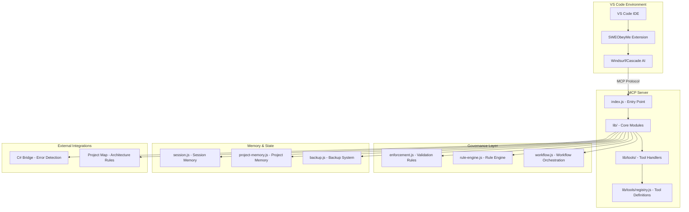

## Module Architecture

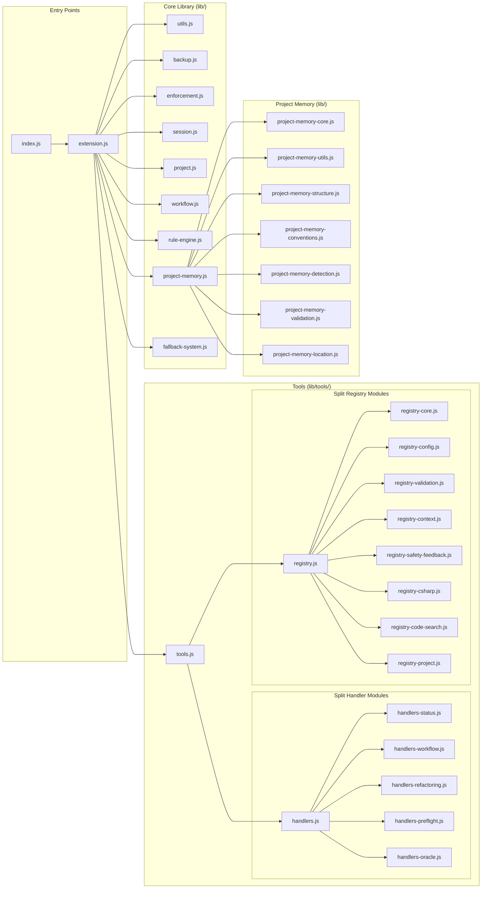

## Tool Execution Flow

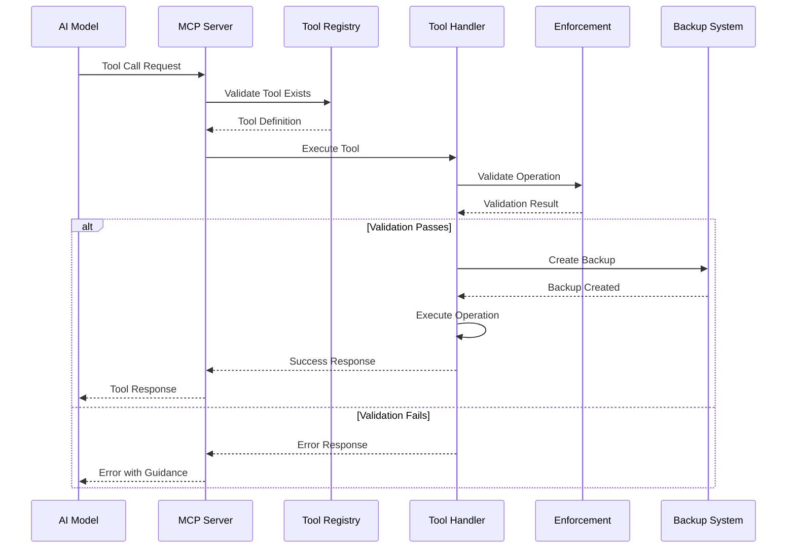

## Surgical Governance Flow

```mermaid
graph TD
    A[File Operation Request] --> B{Check Surgical Plan}
    B -->|Not Validated| C[Call obey_surgical_plan]
    B -->|Validated| D[Check Line Count}

    C --> E{Within Limits?}
    E -->|Yes| D
    E -->|No| F[Suggest Refactoring]

    D -->|Within Limits| G[Check Forbidden Patterns]
    D -->|Exceeds Limits| F

    G -->|Clean| H{Requires Backup?}
    G -->|Has Patterns| I[Auto-Correction]

    I --> J[Remove Patterns]
    J --> H

    H -->|Yes| K[Create Backup]
    H -->|No| L[Execute Write]

    K --> M[Verify Backup]
    M -->|Success| L
    M -->|Failure| N[Error: Backup Failed]

    L --> O{Loop Detection}
    O -->|Loop Detected| P[Block Operation]
    O -->|No Loop| Q[Success]

    F --> R[Call refactor_move_block or extract_to_new_file]
    N --> S[Error Response]
    P --> S
    Q --> T[Return Success]
```

## Project Memory Architecture

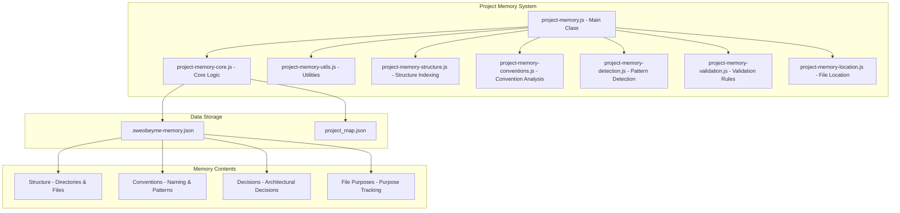

## C# Bridge Architecture

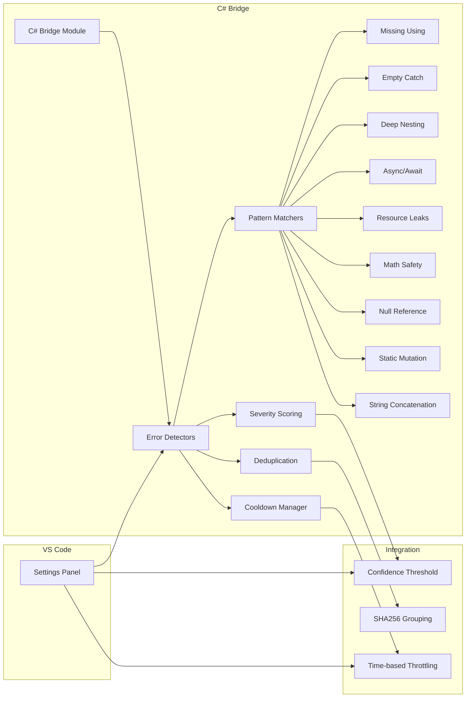

## Data Flow Diagram

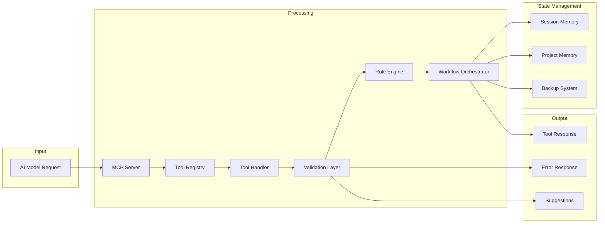

## Configuration Flow

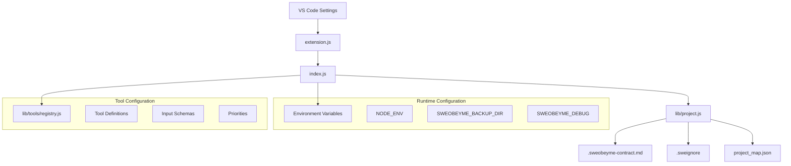

## Error Handling Flow

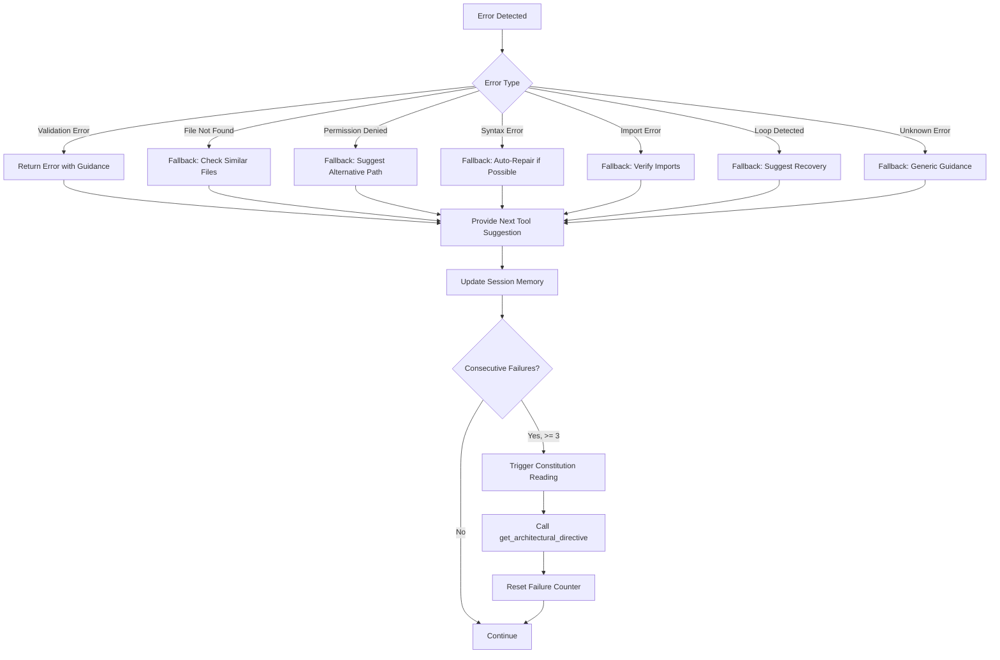

## Component Relationships

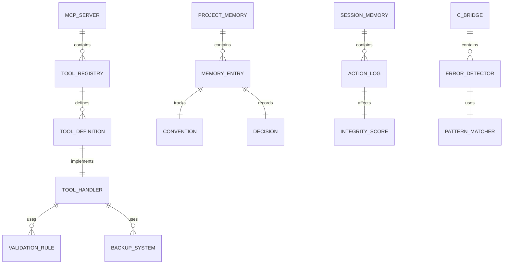

## Deployment Architecture

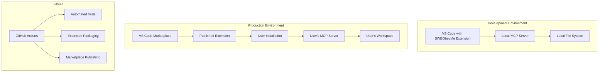

## Security Layers

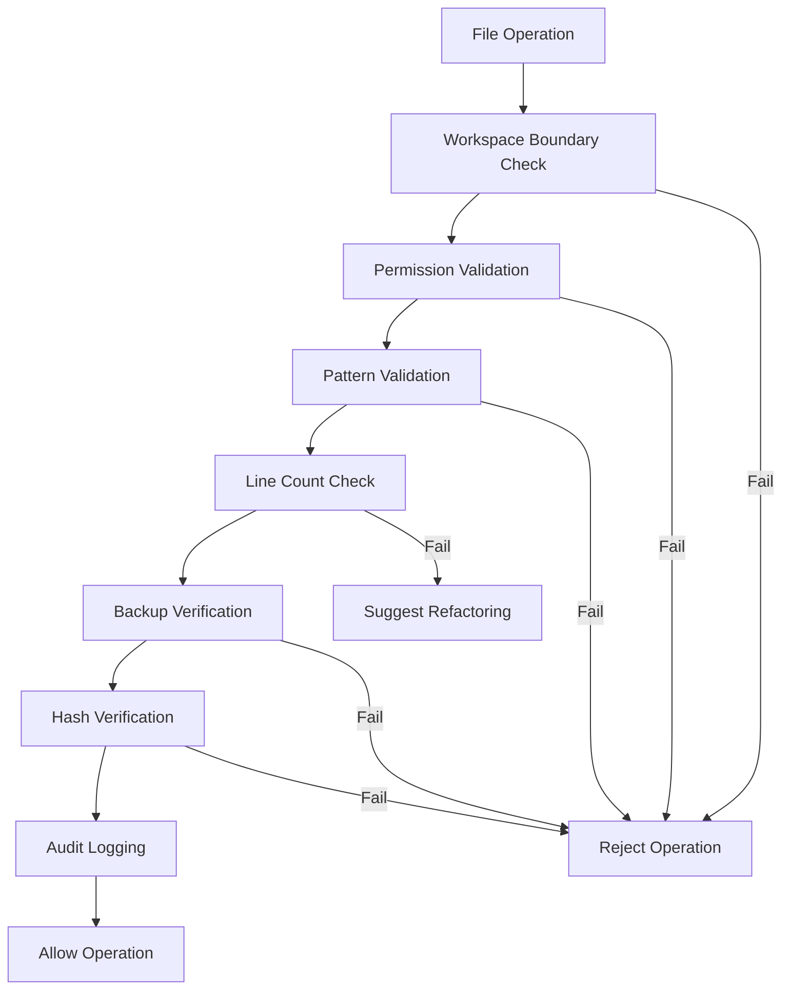

## Summary

SWEObeyMe follows a modular architecture with clear separation of concerns:

- **Entry Points**: index.js and extension.js handle initialization
- **Core Library**: lib/ contains business logic modules
- **Tools**: lib/tools/ contains split handler and registry modules
- **Governance**: enforcement.js, rule-engine.js, workflow.js enforce rules
- **Memory**: session.js, project-memory.js maintain state
- **Integrations**: C# Bridge, Project Map provide external capabilities

All file operations pass through surgical validation with automatic backups and comprehensive error handling.
