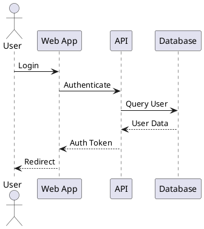
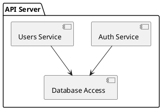

# Documentation & Knowledge Architecture

## Overview

This document covers information architecture, documentation patterns, API documentation standards, and diagrams (C4 model, sequence diagrams). These concepts enable MasterControl to generate real documentation, not just text blobs.

## Information Architecture

### Core Principles

- **User-Centered**: Design for users
- **Scannable**: Easy to scan
- **Searchable**: Easy to search
- **Maintainable**: Easy to maintain

### Documentation Types

#### User Documentation

- **Tutorials**: Step-by-step guides
- **How-To Guides**: Specific tasks
- **Reference**: Reference information
- **Explanation**: Conceptual explanations

#### Developer Documentation

- **API Docs**: API documentation
- **Architecture Docs**: Architecture documentation
- **Setup Guides**: Setup instructions
- **Troubleshooting**: Troubleshooting guides

#### Internal Documentation

- **Design Docs**: Design documentation
- **Meeting Notes**: Meeting notes
- **Decisions**: Decision records
- **Runbooks**: Operational runbooks

### Documentation Structure

#### Hierarchical Structure

```
/
├── Getting Started/
│   ├── Installation
│   ├── Quick Start
│   └── Tutorial
├── User Guide/
│   ├── Features
│   ├── Configuration
│   └── Troubleshooting
├── Developer Guide/
│   ├── Architecture
│   ├── API Reference
│   └── Contributing
└── Reference/
    ├── CLI Reference
    ├── Configuration Reference
    └── Glossary
```

#### Task-Based Structure

- **Tasks**: Organize by user tasks
- **Scenarios**: Organize by scenarios
- **User Journeys**: Organize by user journeys
- **Use Cases**: Organize by use cases

### Navigation Design

- **Breadcrumbs**: Breadcrumb navigation
- **Sidebar**: Sidebar navigation
- **Search**: Search functionality
- **Related**: Related content links

## Documentation Patterns

### Diátaxis Framework

- **Tutorials**: Learning-oriented
- **How-To Guides**: Problem-oriented
- **Explanation**: Understanding-oriented
- **Reference**: Information-oriented

### Tutorial Pattern

- **Goal**: Clear learning goal
- **Prerequisites**: Clear prerequisites
- **Steps**: Step-by-step instructions
- **Outcome**: Clear expected outcome
- **Troubleshooting**: Common issues

### How-To Guide Pattern

- **Problem**: Clear problem statement
- **Solution**: Step-by-step solution
- **Examples**: Concrete examples
- **Prerequisites**: Clear prerequisites
- **Related**: Related guides

### Explanation Pattern

- **Concept**: Clear concept explanation
- **Context**: Why it matters
- **Examples**: Concrete examples
- **Relationships**: Relationships to other concepts
- **References**: References for deeper learning

### Reference Pattern

- **Comprehensive**: Complete reference
- **Structured**: Well-structured
- **Searchable**: Easy to search
- **Examples**: Usage examples
- **Parameters**: Parameter descriptions

## API Documentation Standards

### OpenAPI (Swagger)

#### Basic Structure

```yaml
openapi: 3.0.0
info:
  title: My API
  version: 1.0.0
  description: API description
servers:
  - url: https://api.example.com/v1
paths:
  /users:
    get:
      summary: List users
      responses:
        '200':
          description: Success
```

#### Paths

```yaml
paths:
  /users:
    get:
      summary: List users
      description: Get list of users
      parameters:
        - name: limit
          in: query
          schema:
            type: integer
      responses:
        '200':
          description: Success
          content:
            application/json:
              schema:
                type: array
                items:
                  $ref: '#/components/schemas/User'
```

#### Schemas

```yaml
components:
  schemas:
    User:
      type: object
      properties:
        id:
          type: string
        name:
          type: string
        email:
          type: string
          format: email
      required:
        - id
        - name
```

#### Security

```yaml
components:
  securitySchemes:
    bearerAuth:
      type: http
      scheme: bearer
      bearerFormat: JWT

security:
  - bearerAuth: []
```

### GraphQL Documentation

#### Schema Documentation

```graphql
"""
User represents a user in the system
"""
type User {
  """
  Unique identifier for the user
  """
  id: ID!

  """
  User's full name
  """
  name: String!

  """
  User's email address
  """
  email: String!

  """
  Posts created by this user
  """
  posts: [Post!]!
}
```

#### Query Documentation

```graphql
"""
Get a user by ID
"""
query GetUser($id: ID!): User
```

### REST API Documentation

#### Endpoint Documentation

```
GET /users

Get a list of users

Parameters:
  limit (optional): Number of users to return (default: 10)
  offset (optional): Number of users to skip (default: 0)

Response:
  200 OK
  [
    {
      "id": "123",
      "name": "John",
      "email": "john@example.com"
    }
  ]

Errors:
  400 Bad Request
  500 Internal Server Error
```

### Documentation Best Practices

- **Examples**: Provide examples
- **Error Codes**: Document error codes
- **Rate Limits**: Document rate limits
- **Authentication**: Document authentication
- **Versioning**: Document versioning

## Diagrams

### C4 Model

#### Context Diagram

- **Purpose**: System context
- **Scope**: Entire system
- **Elements**: System, users, external systems
- **Relationships**: Relationships between elements

```
┌─────────────┐
│   User      │
└──────┬──────┘
       │
       │ uses
       │
┌──────▼──────┐
│  My System  │
└──────┬──────┘
       │
       │ uses
       │
┌──────▼──────┐
│  Database   │
└─────────────┘
```

#### Container Diagram

- **Purpose**: Container overview
- **Scope**: Single system
- **Elements**: Applications, databases, queues
- **Relationships**: Relationships between containers

```
┌─────────────────────────────────┐
│         Web Application         │
└──────────────┬──────────────────┘
               │ HTTP
               │
┌──────────────▼──────────────────┐
│         API Server             │
└──────┬──────────────┬───────────┘
       │              │
       │ SQL          │
       │              │
┌──────▼──────┐ ┌────▼────────┐
│  Database   │ │   Cache     │
└─────────────┘ └─────────────┘
```

#### Component Diagram

- **Purpose**: Component structure
- **Scope**: Single container
- **Elements**: Components, modules
- **Relationships**: Relationships between components

```
┌─────────────────────────────────┐
│         API Server             │
├─────────────────────────────────┤
│ ┌─────────────┐ ┌─────────────┐ │
│ │   Auth      │ │   Users     │ │
│ │  Service    │ │  Service    │ │
│ └──────┬──────┘ └──────┬──────┘ │
│        │               │        │
│        └───────┬───────┘        │
│                │                │
│         ┌──────▼──────┐         │
│         │   Database  │         │
│         │   Access    │         │
│         └─────────────┘         │
└─────────────────────────────────┘
```

#### Code Diagram

- **Purpose**: Code structure
- **Scope**: Single component
- **Elements**: Classes, functions
- **Relationships**: Relationships between code elements

### Sequence Diagrams

#### Basic Sequence Diagram

```
User → Web App: Login
Web App → API: Authenticate
API → Database: Query User
Database → API: User Data
API → Web App: Auth Token
Web App → User: Redirect
```

#### Complex Sequence Diagram

```
User → Web App: Create Order
Web App → API: POST /orders
API → Database: Create Order
API → Payment Service: Process Payment
Payment Service → Bank: Charge
Bank → Payment Service: Success
Payment Service → API: Payment Confirmed
API → Database: Update Order
API → Web App: Order Created
Web App → User: Confirmation
```

### PlantUML

#### Sequence Diagram



#### Component Diagram



### Diagram Best Practices

- **Clear**: Clear and simple
- **Consistent**: Consistent notation
- **Labeled**: Properly labeled
- **Context**: Provide context
- **Updated**: Keep updated

## Documentation Tools

### Static Site Generators

- **Docusaurus**: React-based static site generator
- **Jekyll**: Ruby-based static site generator
- **Hugo**: Go-based static site generator
- **MkDocs**: Python-based static site generator
- **VitePress**: Vue-based static site generator

### API Documentation Tools

- **Swagger UI**: OpenAPI UI
- **Redoc**: OpenAPI alternative UI
- **Postman**: API testing and documentation
- **Insomnia**: API client
- **GraphQL Playground**: GraphQL explorer

### Diagram Tools

- **PlantUML**: Text-based diagrams
- **Mermaid**: Markdown diagrams
- **draw.io**: Diagram editor
- **Lucidchart**: Online diagram tool
- **Excalidraw**: Hand-drawn style diagrams

## Best Practices

### Writing

- **Audience**: Write for audience
- **Clear**: Clear and concise
- **Active Voice**: Use active voice
- **Present Tense**: Use present tense
- **Examples**: Provide examples

### Structure

- **Scannable**: Easy to scan
- **Headings**: Use headings
- **Lists**: Use lists
- **Code Blocks**: Use code blocks
- **Tables**: Use tables

### Maintenance

- **Review**: Regularly review
- **Update**: Update when code changes
- **Archive**: Archive outdated docs
- **Delete**: Delete obsolete docs
- **Version**: Version documentation

### Accessibility

- **Alt Text**: Alt text for images
- **Headings**: Proper heading hierarchy
- **Links**: Descriptive link text
- **Color**: Sufficient color contrast
- **Keyboard**: Keyboard accessible

### Searchability

- **Keywords**: Include keywords
- **Meta**: Meta descriptions
- **Sitemap**: Sitemap
- **Internal Links**: Internal links
- **External Links**: External links
